# Running the AIKOL Booking System

A guide for the Kulliyyah office: the administrators who run the system and the approvers who
decide bookings. It covers everything the office does that a requester never sees. For booking a
room or car yourself, the requester's user guide applies to you as well.

Address: `https://aikol-booking-qn23bk3fqa-as.a.run.app`

---

## Who does what

| Role | Can |
| --- | --- |
| **Approver** | Approve and reject booking requests, and see the booking history. Nothing else in the office pages. |
| **Administrator** | Everything: decisions, keys, venues and vehicles, people, reports, rules, site wording, data and the audit log. |

On screen, requesters are told to "contact **the Admin**". That means you.

Every approver and administrator also has an ordinary account: you can make your own bookings in
the same way as anyone else.

---

## 1. Signing in with the authenticator

Approvers and administrators sign in with a password **and** a six-digit code from an
authenticator app on their phone (Google Authenticator, Microsoft Authenticator or Authy). Ordinary
users are not asked for a code.

**The first time**, after your password you are shown a QR code. Scan it with the app, type the
six digits the app shows, and continue. You are then shown **ten recovery codes, once only**. Write
them down or print them and keep them somewhere that is not your phone. Each works a single time,
in place of the app's code, if your phone is lost.

**Every time after that**, type the six digits the app shows at that moment.

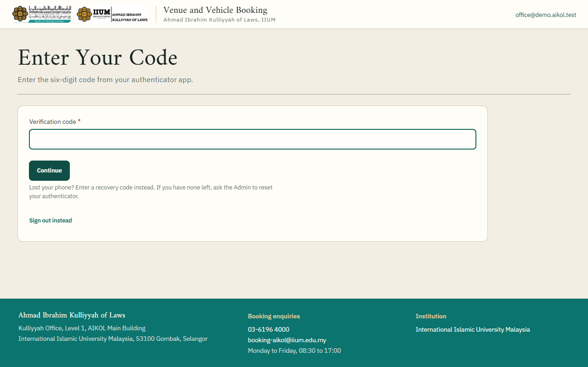

*After the password, the code from the authenticator app.*

If a colleague loses both their phone and their recovery codes, open their record under **People**
and choose **Reset authenticator**. They set up a new one at their next sign-in. You cannot reset
your own; ask another administrator.

---

## 2. Finding your way around

The menu runs down the left side. Above the rule are your own pages (Home, My Bookings, Venue,
Vehicles); below it is the office's work.

| Menu | What is there | Section |
| --- | --- | --- |
| **Overview** | What needs attention today | 3 |
| **Bookings** | Every booking, the Awaiting Decision queue, and booking for someone else. The number beside it is how many requests are waiting | 4, 5 |
| **Keys** | Keys to hand out, keys out, keys overdue | 6 |
| **Resources** | Venues, vehicles and facilities, with photographs | 7 |
| **People** | Every account, roles and authenticators | 8 |
| **Insights** | Reports and the bookings export | 9 |
| **System** | Booking rules, email delivery, academic calendars, site wording, the wording of each email, data and the audit log | 10 |

An **approver** sees two entries instead: **Queue** (requests to decide) and **History**.

Most pages have a **Back** link at the top that returns to the list the page belongs to.

---

## 3. Overview

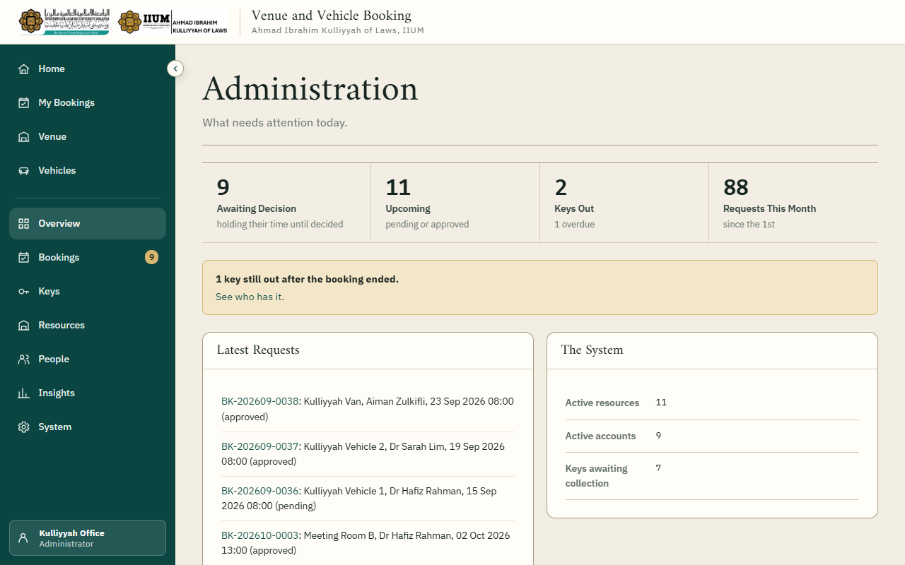

*Overview: the figures across the top, then anything overdue, then the latest requests.*

Start the day here. The figures show requests awaiting a decision, upcoming bookings, keys out and
this month's requests. A yellow notice appears when a key is still out after its booking ended.

---

## 4. Deciding bookings

### The booking register

**Bookings** lists every booking. The tabs switch between **Venues**, **Vehicles** and **Awaiting
Decision**. Search by reference, person, email or resource, and filter by status.

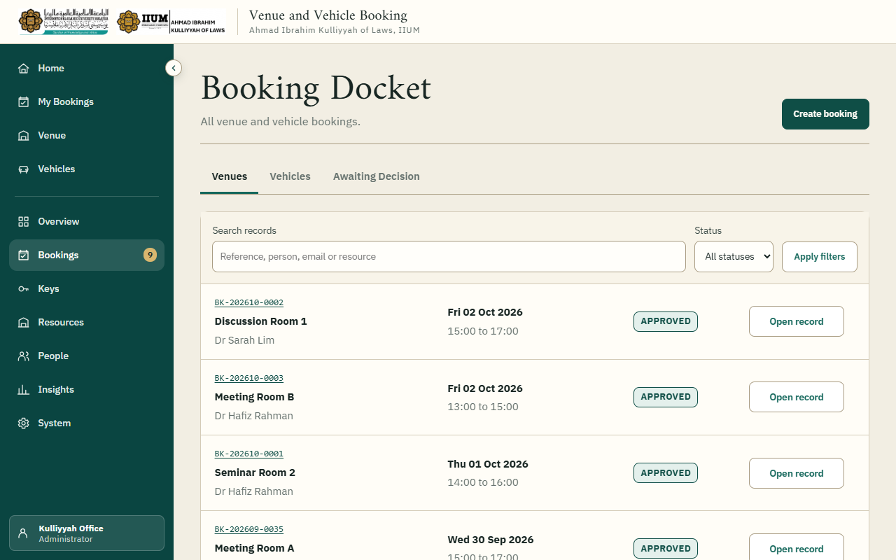

*Bookings: every venue booking, newest first.*

### Awaiting Decision

The queue of pending requests, soonest first. Each has a **Decide** button.

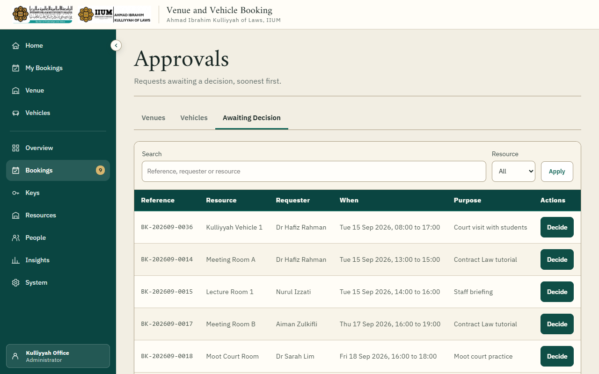

*Awaiting Decision: pending requests, soonest first.*

### Approving or rejecting

**Decide** shows the request and any other booking that overlaps it.

- **Approve** needs no reason. The requester is emailed.
- **Reject** needs a reason, which the requester sees in their email.

The time is checked again as you approve. If somebody else's booking has been approved for the
same time since, the approval is refused and the page says so. A warning appears if the request's
start time has already passed.

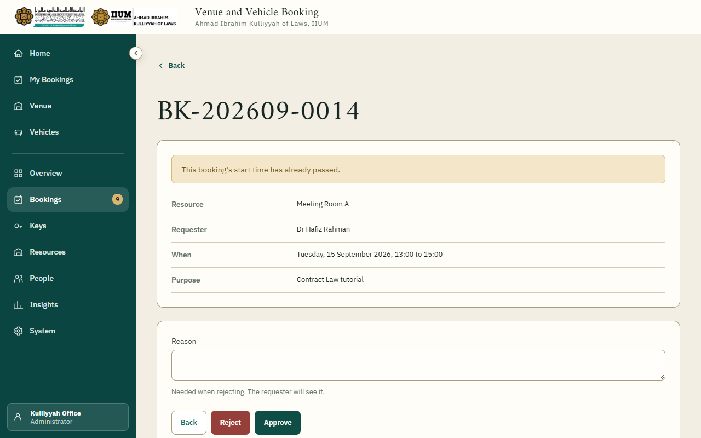

*Decide: the request's details, then the reason and the two buttons.*

A **weekly series** is decided as one: approving it approves every date that is still free and
sends the requester a single email listing them.

### Vehicle bookings: the second decision

A car needs two approvals. After the ordinary approval above, open the booking and choose
**Management decision**. Record Kulliyyah management's decision and, when approved, the VMU driver's
name and contact number. The requester is emailed each time. The car's key cannot be issued until
both approvals are in.

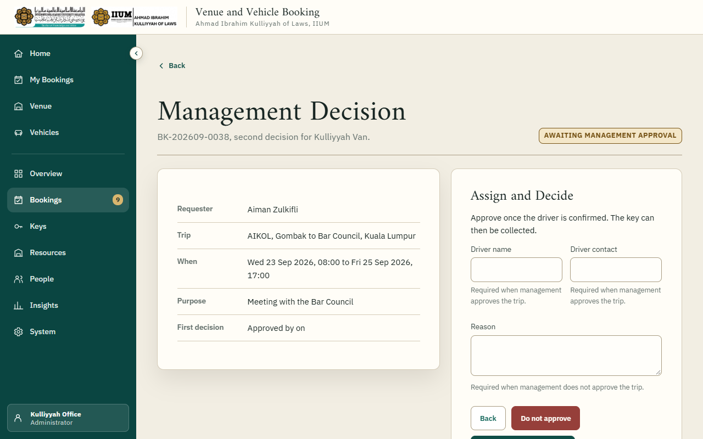

*Management decision: the second approval for a car, with the driver.*

### Cancelling for someone

Open the booking and choose **Cancel booking**. A reason is required. The three-day notice that
limits requesters does not apply to the office.

---

## 5. Booking for someone else

Under **Bookings**, choose **Create booking**, then the room or car. The form has a **Booking for**
search: type a name, email or matriculation number and pick the person. The booking is recorded as
made by you for them, and the confirmation goes to them. Leave the search empty to book for
yourself.

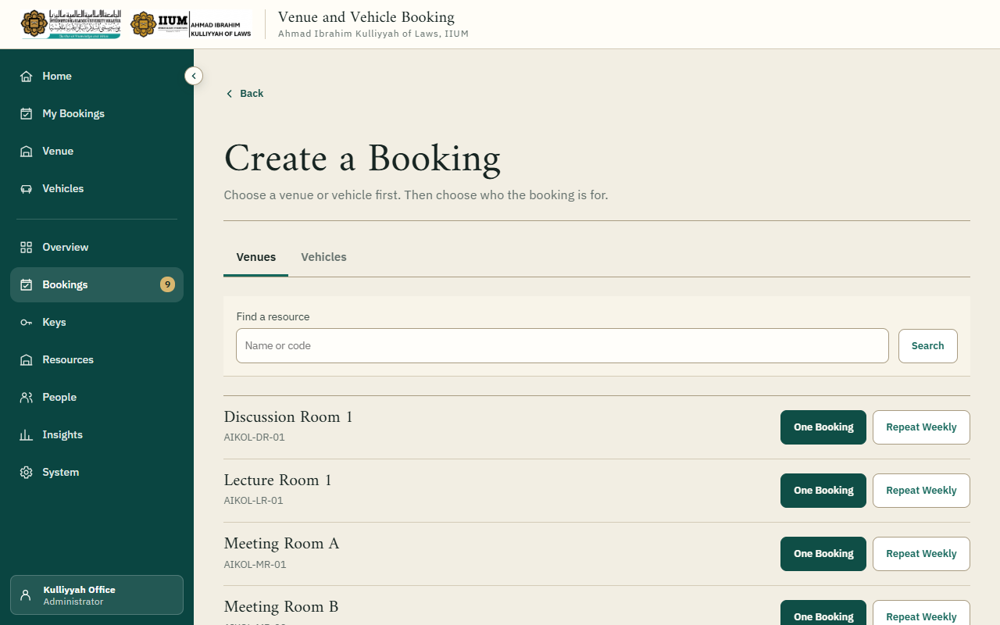

*Create booking: choose the room or car first.*

---

## 6. Keys

**Keys** has three lists: **Awaiting Collection** (approved bookings whose key is still with you),
**Keys Out**, and **Overdue** (still out after the booking ended).

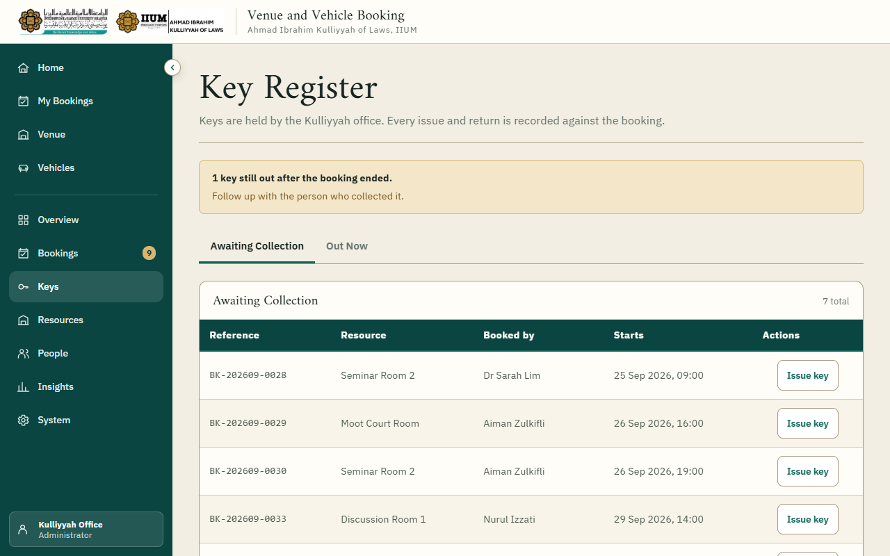

*Keys: what to hand out, what is out, and what is overdue.*

**Issuing a key.** Choose **Issue key** on the booking. If the person who booked is collecting it,
leave **Collected by** blank and their name is recorded. If someone else comes, type that person's
name and telephone number.

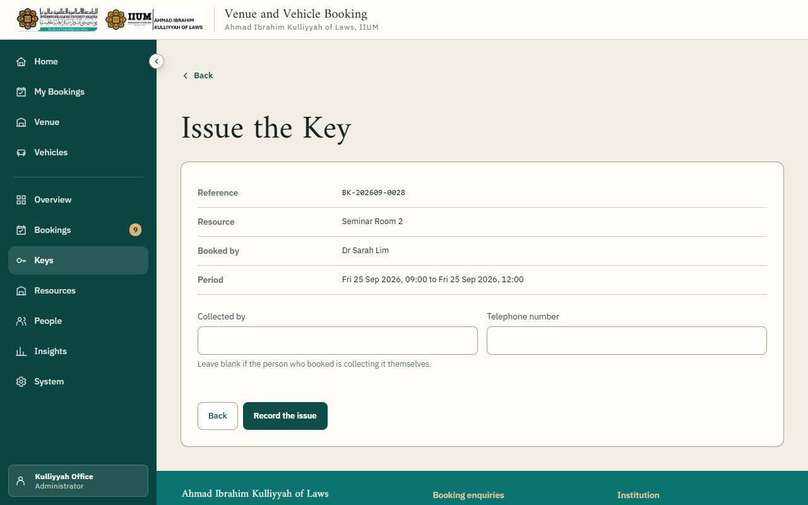

*Issue the Key: leave Collected by blank when the person who booked collects it.*

**Taking a key back.** Choose **Record return** on the key under **Keys Out**, record who handed it back, and note any damage or
anything left behind.

---

## 7. Venues, vehicles and facilities

**Resources** has three tabs: **Venues**, **Vehicles** and **Facilities**.

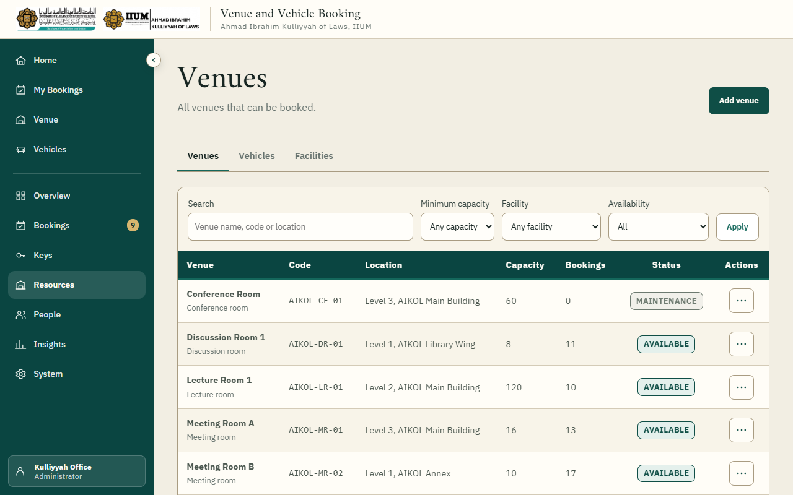

*Resources, Venues: each venue with its status and actions.*

**Adding or editing.** Choose **Add venue** (or **Add vehicle**), or **Edit** from a row's
actions. A venue has a type, location, seats, opening hours and facilities. A vehicle has its
registration number, make, model, seats and road tax expiry; a car past its road tax date is
withdrawn from booking automatically.

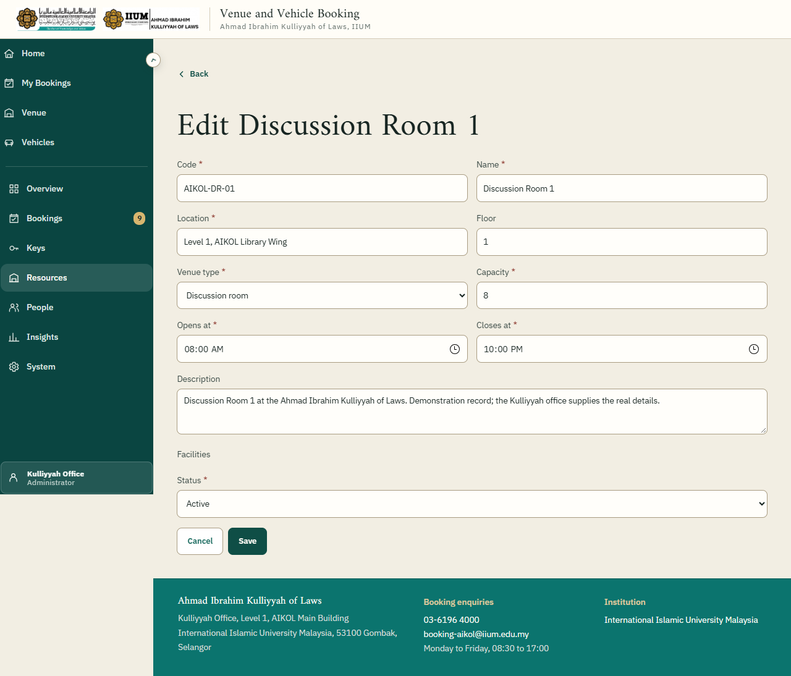

*Editing a venue.*

**Photographs.** Choose **Images** from a row's actions. Add several at once, or drag photographs
onto the page. JPEG, PNG or WebP, up to 5 MB each. The arrows move a photograph earlier or later;
the **first** one is shown everywhere else. A venue with no photograph shows a drawing instead.

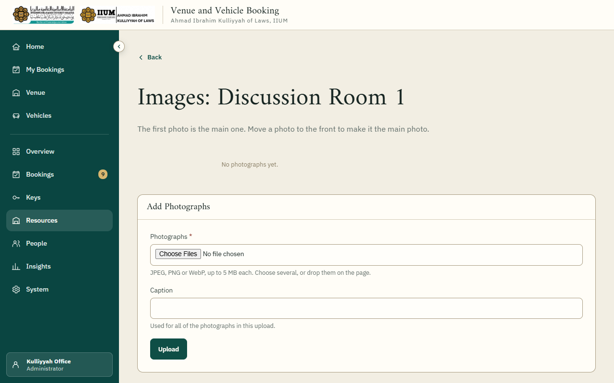

*Images: the first photograph is the main one.*

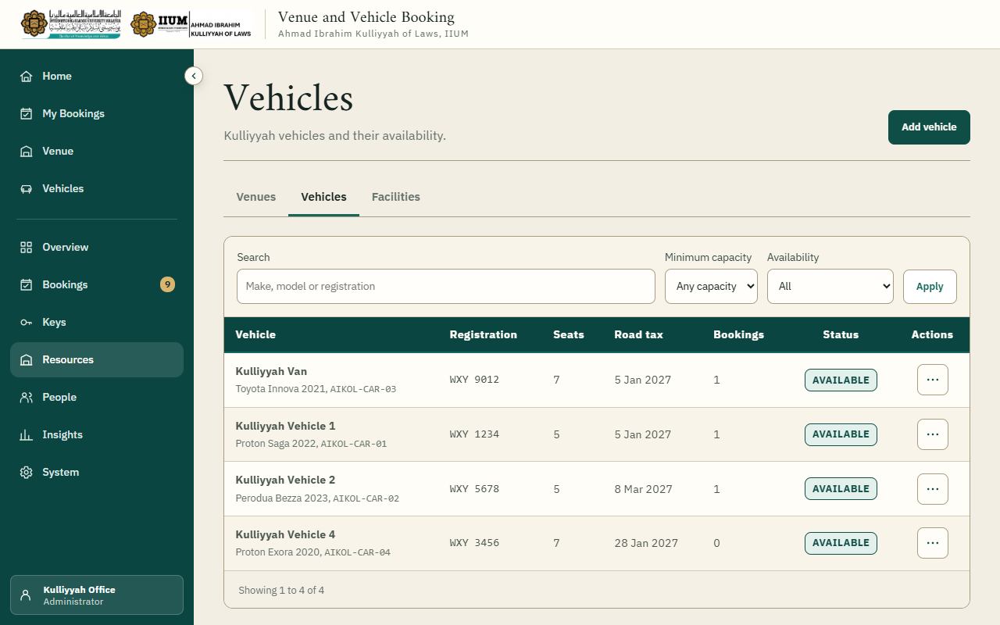

*Resources, Vehicles.*

**Taking something out of use.** Set its status to maintenance or inactive. It disappears from the
requester's lists; bookings already made are not cancelled, so deal with each one.

**Deleting.** Only for a record entered in error. It must be made inactive first, and it must have
no bookings at all. A venue or car that has ever been booked stays in the system, inactive, because
the booking history needs it.

**Facilities** are the features a venue can have (projector, microphone and so on). Add, rename or
stop offering them here, and drag the rows into the order they should appear on the venue form.

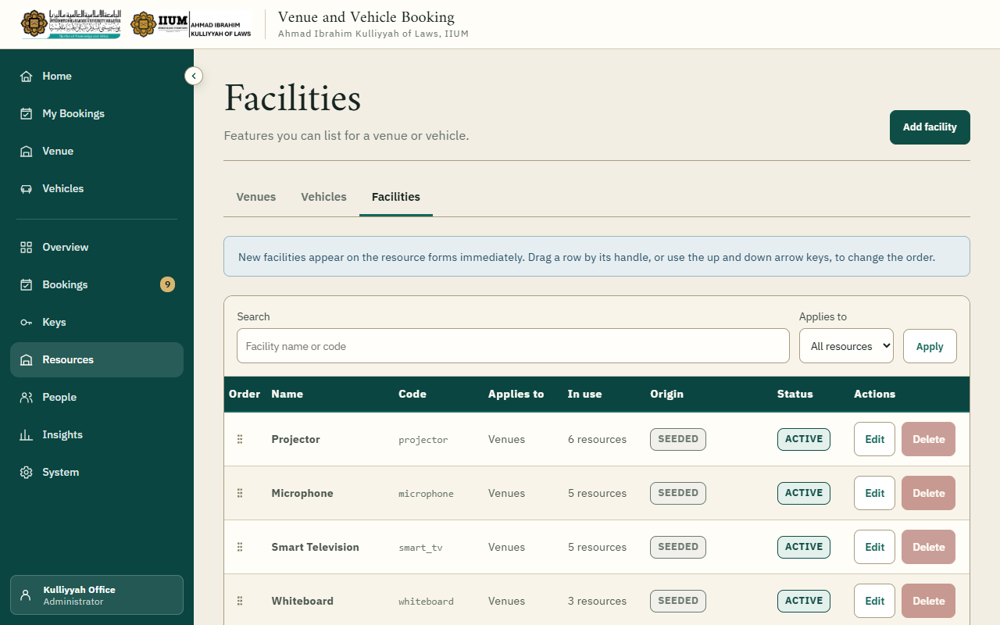

*Resources, Facilities.*

---

## 8. People

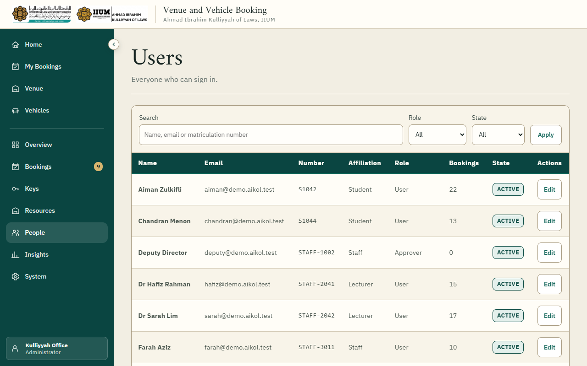

*People: search by name, email or matriculation number; filter by role and state.*

Open a person to change their details, affiliation or role.

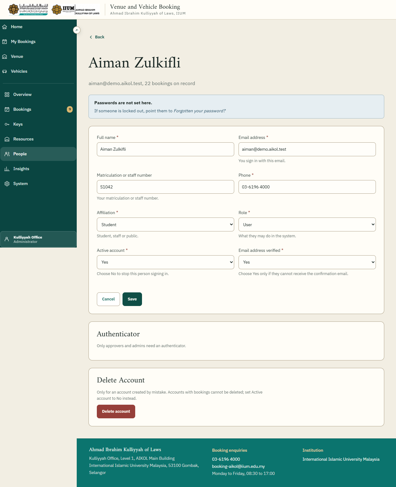

*A person's record, with the authenticator section below.*

- **Role.** User, Approver or Administrator. A person made an approver or administrator is asked to
  set up the authenticator at their next sign-in.
- **Active account.** Set to **No** to retire an account. The person cannot sign in; their booking
  history is kept.
- **Email address verified.** Set to **Yes** yourself only when the verification email cannot
  reach them.
- There is **no password field**. A person who is locked out uses **Forgotten your password?** on
  the sign-in page.
- **Delete account** is for an account created in error. It must be retired first and have no
  bookings. You cannot delete your own.

---

## 9. Insights

Reports for 30 days, 90 days or a year: bookings and approval rate, room demand by hour and day,
bookings per month, how much each resource is used, keys, and the most frequent requesters.
**Export bookings** downloads every booking as a CSV file for Excel.

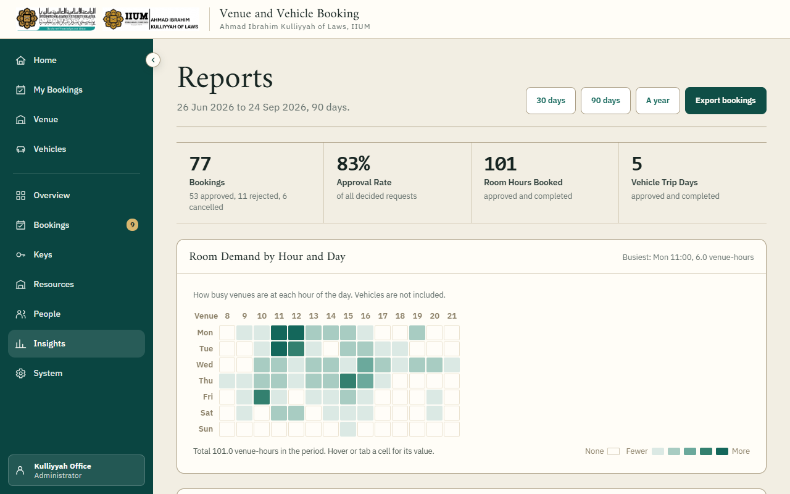

*Insights.*

---

## 10. System

The tabs across the top are **Booking Rules**, **Academic Calendars**, **Site Content**, **Emails**, **Data**
and **Audit Log**.

### Booking rules and email

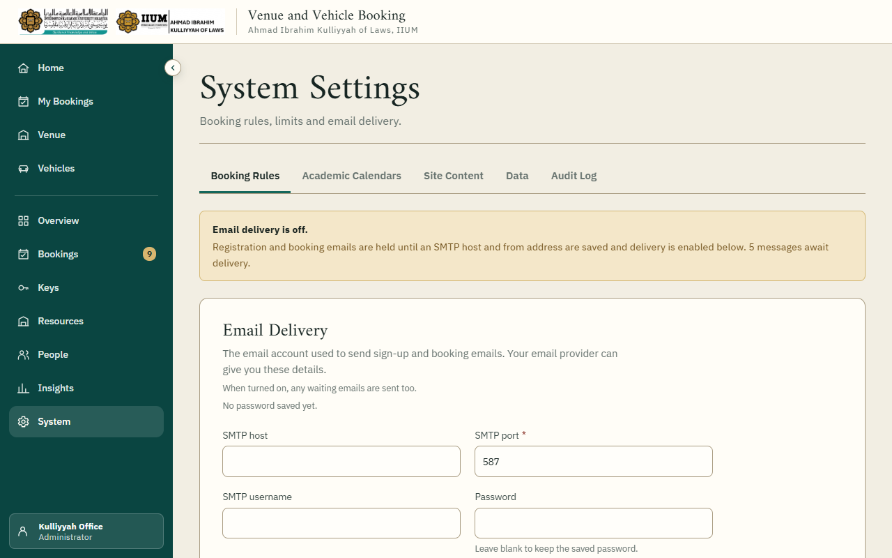

*Booking Rules: email delivery at the top, then each rule with its own Save.*

**Email delivery.** The SMTP details for the office mailbox. For Gmail: host `smtp.gmail.com`, port
`587`, encryption **STARTTLS**, the Gmail address as username and From address, and a Google **App
Password** (not the normal password). Leave the password box empty to keep the stored one. **Email
delivery: Yes** sends waiting messages within a minute. **No** holds them, which is useful while
changing the settings.

**Rules.** Each has a plain description. Change a value and choose that row's **Save**. The rules
the Kulliyyah confirmed are the defaults: 90 days ahead, nine hours longest, 08:00 to 22:00, 72
hours' cancellation notice, records kept seven years. Changes take effect straight away and are
written to the audit log.

### Academic calendars

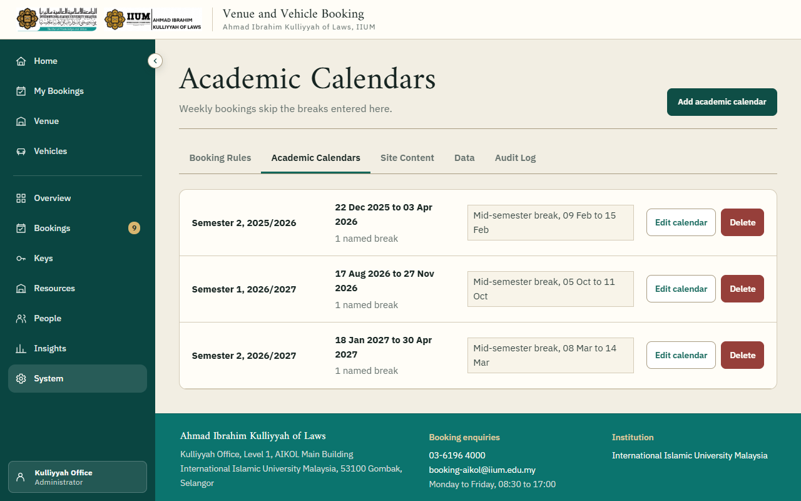

*Academic Calendars: each semester with its breaks.*

Each semester has a start and end date and its breaks. Weekly bookings are made against one of
these: dates inside a break are left out. Semesters cannot overlap. Deleting a calendar does not
touch bookings already made.

### Site content and announcements

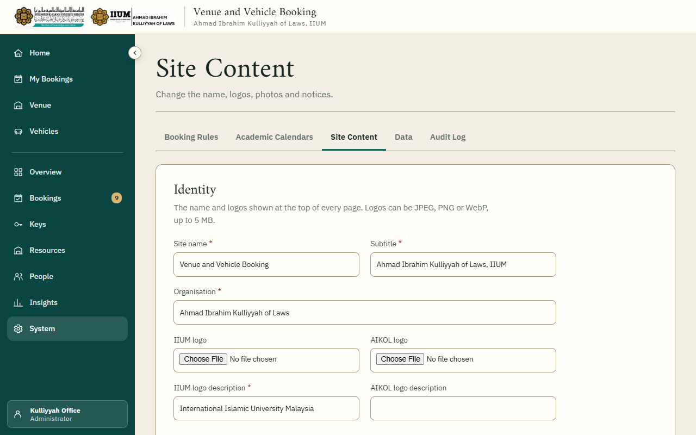

*Site Content: each section has its own Save.*

The name, logos, photographs and wording that appear in the header, the footer, the sign-in page
and the home page. **Remove image** on a logo or photograph returns the built-in one.

Under **Contact and Footer**, enter the telephone and fax numbers, and one email address per line
if more than one office answers booking questions. The copyright line at the very bottom of every
page starts with the current year, which changes by itself; only the wording after it is edited here.

**Announcements** appear on every requester's home page. Set a start and end time to schedule one,
or set **Published: No** to take it down while keeping it on file.

### Emails

Every email the system sends is listed here with when it goes out: booking received, approved,
not approved, cancelled, the car's management decision, weekly bookings, confirming an email
address, resetting a password, and accounts the office creates. **Edited** means the office has
changed it; **Default** means it reads as it was installed.

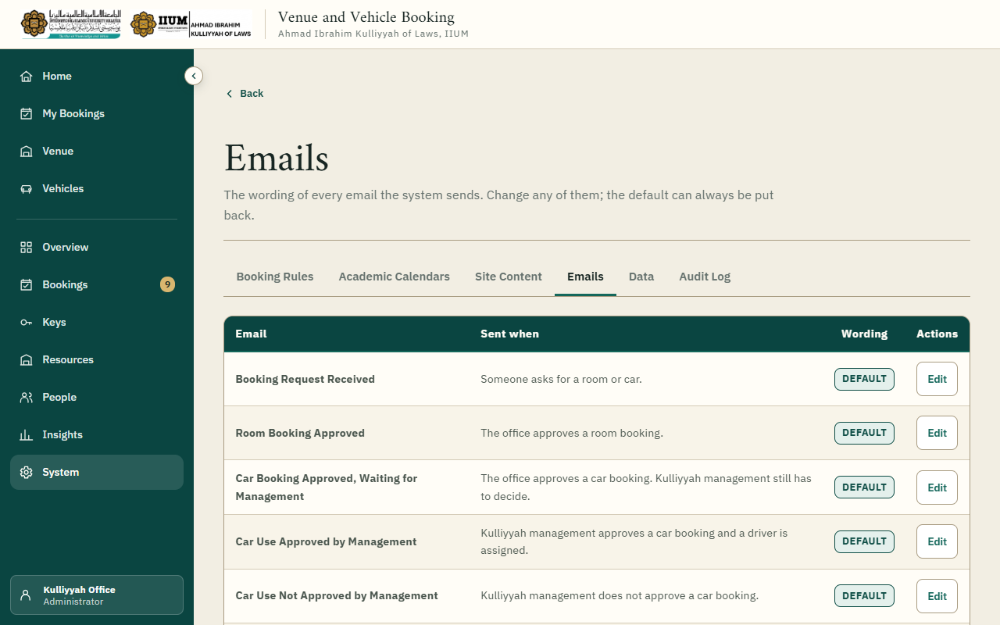

*Emails: each email, when it is sent, and whether its wording has been changed.*

Choose **Edit** to change an email's subject and message. Words in braces, such as `{name}` or
`{reference}`, are filled in for each person; the list beside the form says what each one
contains. Only those can be used, and a few must stay in: an email that asks someone to confirm
their address or reset a password must keep `{link}`, and a rejection must keep `{reason}`.
**Preview** shows the email with sample details without saving it. **Save** uses the new wording
from the next email onwards, and the change is written to the audit log. **Put back the default
wording** undoes every change to that email.

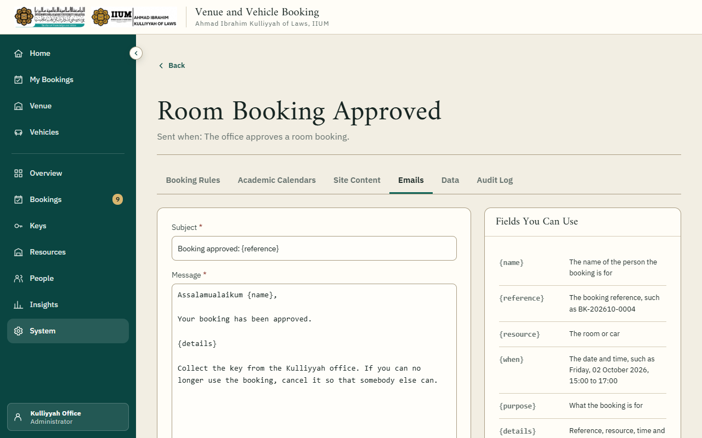

*Editing an email: the fields it can use are listed beside the form.*

### Data

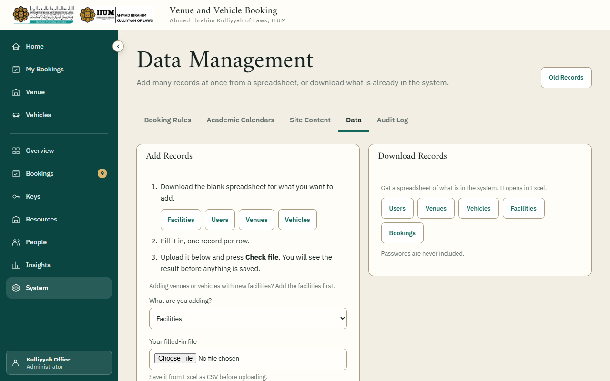

*Data: import and export in CSV.*

Download a template, fill it in in Excel, and upload it. Nothing is written until you have seen the
preview: every row with a problem is listed with its line number and every reason, so the
spreadsheet can be corrected in one go. Users, venues, vehicles and facilities can all be exported.

### Audit log

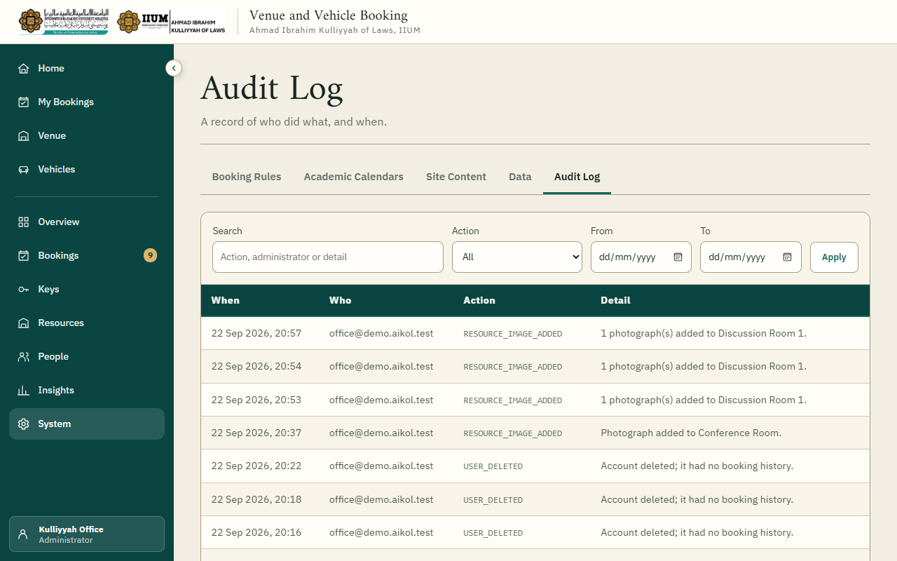

*Audit Log: who did what, and when.*

A record of every decision, change of rule, key handover and change to an account. Entries cannot
be edited or removed.

### Retention

Booking records are kept for seven years. **Old Records**, at the top of the Data page, shows how
many are older than that. They are exported to a file and the copy checked before anything is
removed, and nothing goes without you typing a confirmation.

---

## A day in the office

1. **Overview**: anything overdue?
2. **Bookings, Awaiting Decision**: decide the queue, soonest first.
3. **Vehicle bookings** approved yesterday: record the management decision and the driver.
4. **Keys**: hand out today's keys; chase anything overdue.

---

## If something goes wrong

| What you see | What it means |
| --- | --- |
| Approval refused: "that period has been approved for another booking" | Someone else's request for the same time was approved first. Reject this one, or ask the requester for another time. |
| A key will not issue for a car | Management approval and the driver are not recorded yet. |
| Emails are not arriving | System, Booking Rules: check Email delivery is Yes and the App Password is right. The yellow notice counts the messages waiting. |
| "Set the time on the quarter hour" | Times run in quarter hours: :00, :15, :30 or :45. |
| A venue or car cannot be deleted | It is still active, or it has bookings. Make it inactive; that keeps its history. |
| A colleague is locked out of the authenticator | People, open their record, **Reset authenticator**. |
| You are locked out of your own authenticator | Use a recovery code, or ask another administrator to reset it. |
| A message that something did not reach the server | The reply was lost and the change may still have been saved. Reload the page and look before trying again. |

*The screenshots show fictional demonstration data.*
