# Booking a Venue or Vehicle at AIKOL

A short guide for students, lecturers and staff using the Kulliyyah's booking system for the
first time. Ten minutes covers everything you need.

Address: `https://aikol-booking-qn23bk3fqa-as.a.run.app`. It works on a phone as well as a
laptop; there is nothing to install. Emails from the system arrive within about a minute.

---

## What the system does

You can look up rooms and Kulliyyah cars, see when they are free, and ask to book one. The
Kulliyyah office looks at every request and approves or declines it. You are emailed when a
decision is made. Keys are collected from the office. On screen the office is called
**the Admin**: when a page says "contact the Admin", it means the Kulliyyah office.

Three things to know before you start:

- **Every booking is a request.** Nothing is confirmed until the office approves it. A pending
  request still holds its time, so nobody else can take the same slot while you wait.
- **Rooms** can be booked between 08:00 and 22:00, for up to nine hours at a time, up to three
  months ahead. Weekends and holidays are fine.
- **Cars** come with a Kulliyyah driver arranged by the office. You do not drive the car
  yourself. A car booking also needs Kulliyyah management approval, so allow more time.

---

## Finding your way around

Once you are signed in, the menu is always in the same place. On a laptop it runs down the left
side of every page; the small arrow at its top edge folds it away to give the page more room. On
a phone it sits along the bottom of the screen, and **Menu** opens the rest.

| Page | How to get there | What it is for | In this guide |
| --- | --- | --- | --- |
| **Sign In** | The system's address | Signing in, registering, a forgotten password | Sections 1 and 2 |
| **Home** | **Home** in the menu | A quick search for what is free, notices from the Admin, your next booking | Section 3 |
| **Venue** | **Venue** in the menu | Every room, with search and filters | Section 3 |
| **A room or car** | Choose one from **Venue** or **Vehicles** | Photographs, location, seats, facilities, and the buttons to book | Section 3 |
| **Availability** | **Check availability** on a room or car | A week at a time: what is booked and what is free | Section 4 |
| **Booking form** | **Book this**, or a free part of the availability chart | Asking for a booking | Section 5 |
| **Vehicles** | **Vehicles** in the menu | Every Kulliyyah car | Section 3 |
| **My Bookings** | **My Bookings** in the menu | Everything you have asked for, and its status | Section 7 |
| **A booking** | A reference such as `BK-202610-0004` in My Bookings | The details, and **Cancel booking** | Sections 7 and 8 |
| **Edit Profile** | Your name at the foot of the menu, then **Edit Profile** | Your name, email address and phone number | Section 10 |

Your name at the foot of the menu also holds **Sign Out**. Most pages have a **Back** link at the
top that returns you to the list you came from.

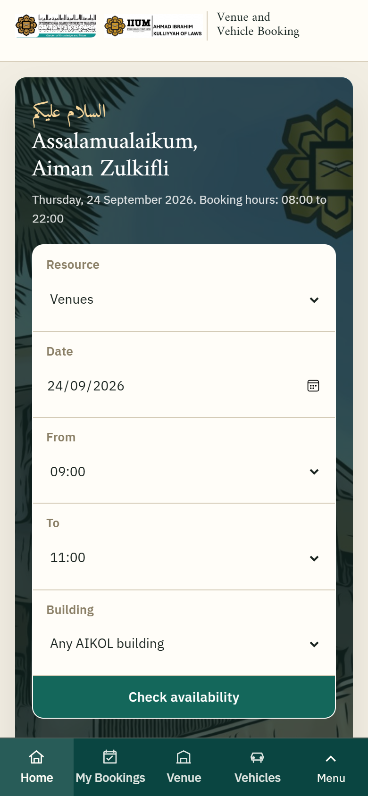

*On a phone the menu runs along the bottom of the screen.*

---

## 1. Create your account

1. Open the address and choose **Register as an IIUM member or public user**.
2. Use your IIUM email address (`@iium.edu.my` or `@live.iium.edu.my`). Enter your name,
   matriculation or staff number, and a phone number the office can reach you on.
3. Choose a password and submit.
4. Open your email and click the link in the message from the office. This confirms your address.
   Until you do, you can sign in but you cannot book.

Members of the public without an IIUM address can register too; choose the public option on the
form.

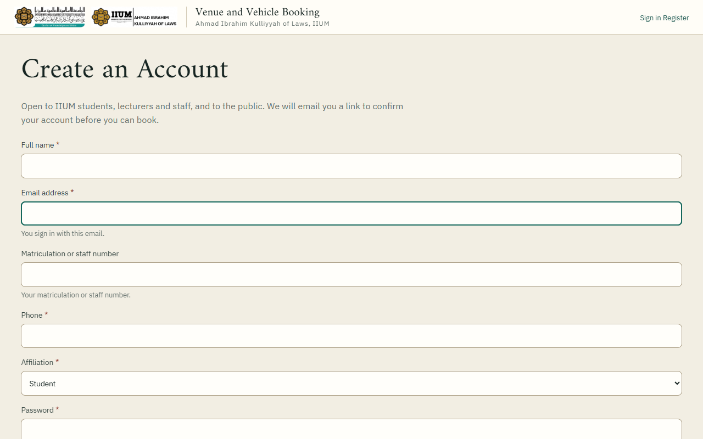

*The registration form.*

If you already had an account and register again, nothing new is created. You will be emailed a
reminder instead, and you can sign in with your existing password or reset it.

## 2. Sign in

Email address and password. If you forget the password, choose **Forgotten your password?** and
follow the link that arrives by email. The link lasts three days.

You stay signed in on your device until you sign out from the menu under your name.

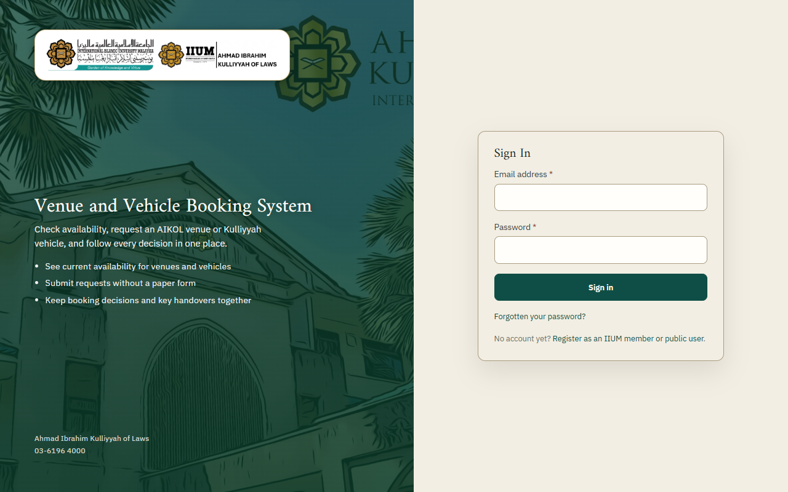

*The Sign In page. Registration and the forgotten-password link are under the form.*

## 3. Find a room or a car

- **Venue** in the menu lists every room: moot court, lecture rooms, seminar rooms, meeting rooms,
  discussion rooms. Search by name or location, or filter by seats and facilities.
- **Vehicles** lists the Kulliyyah cars with their seats.
- Open one to see its photographs, location, capacity and opening hours.

The home page has a quicker route: choose a date and time there and it shows you what is free.

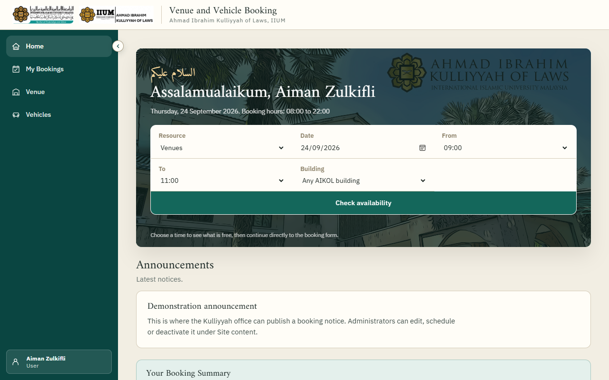

*Home. The search at the top shows what is free at a date and time.*

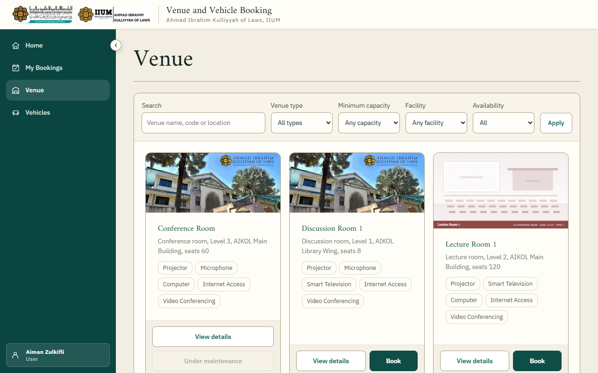

*Venue: every room, with search and filters.*

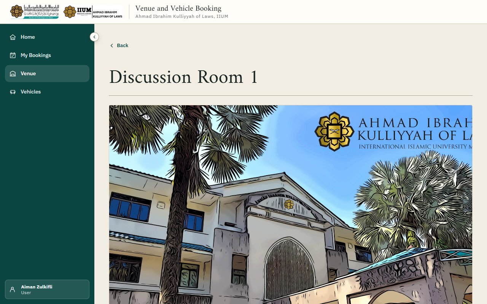

*A room. Check availability and Book this are at the top.*

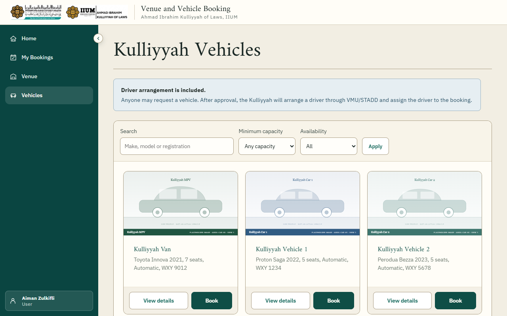

*Vehicles: every Kulliyyah car.*

## 4. See when it is free

On a room or car, choose **Check availability**. You see a week at a time, one row per day:

- **Green** is **booked**.
- **Amber** is **pending approval**, which also holds the time.
- **Empty** is free.

A block says what it covers on that day: "09:00 to 11:00", or "From 14:00", "All day" and
"Until 17:00" for a booking that runs across several days.

Move between weeks with the buttons under the chart, or change the date. **Click any free part
of a day to open the booking form for that day.** Choosing a **From** and **To** time above the
chart carries those times into the form as well.

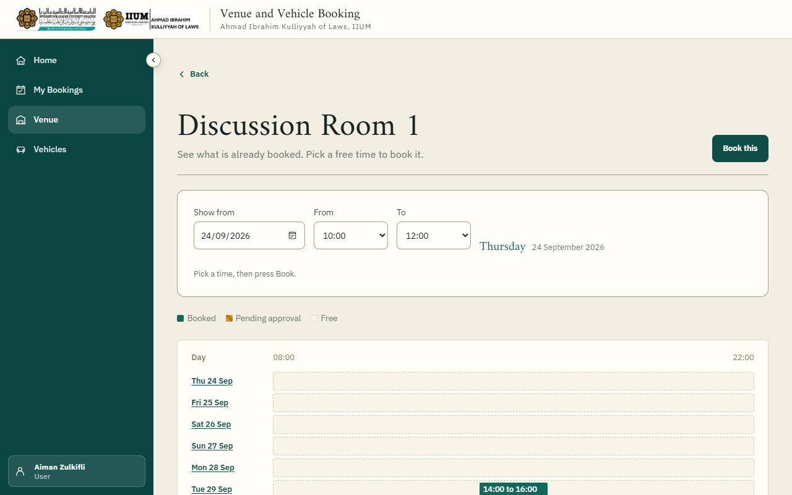

*Availability. Green is booked, amber is pending approval, and the empty part of a row is free.*

## 5. Request a booking

Choose **Book this** on the room or car, or a day in the availability chart.

**For a room**, give the date, the start and end time, what it is for, and how many people. The
purpose matters: the office decides on it. Times are chosen from a list and run in quarter hours,
so a booking starts and ends at :00, :15, :30 or :45.

**For a car**, give the dates and times out and back, where you are going from and to, how many
passengers, and what the trip is for. Trips can span more than one day.

Submit. You get a reference such as `BK-202610-0004` on screen and by email. Keep it.

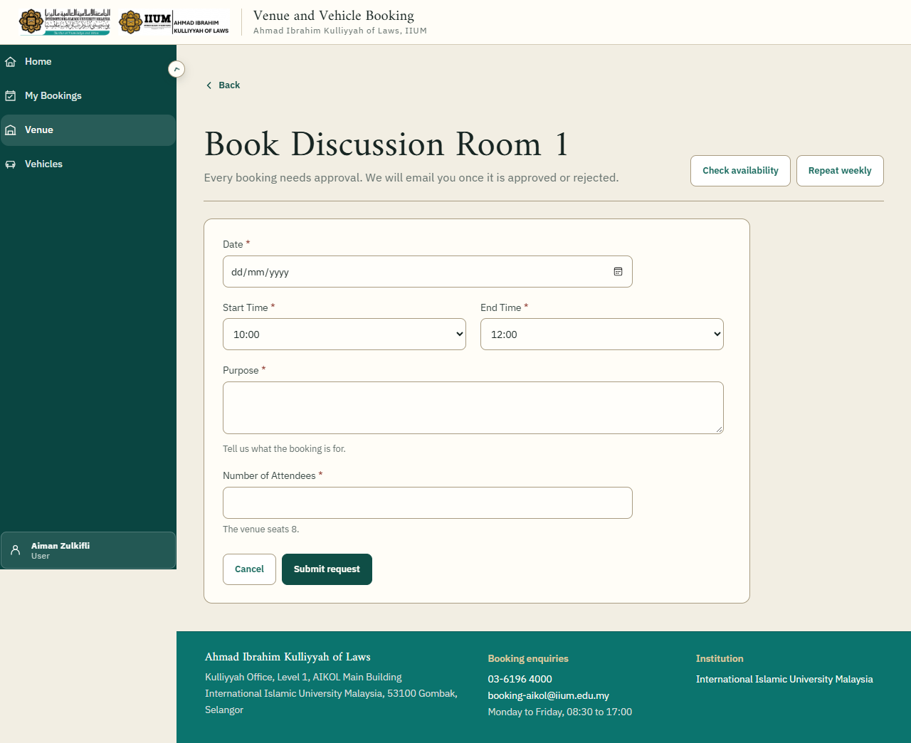

*The booking form for a room: one date, then the start and end times side by side.*

The form will tell you plainly if something is not allowed: the time clashes with another
booking, it is outside opening hours, it is longer than nine hours, it is more than three months
away, or the room is too small for the number of people.

## 6. Book the same slot every week

For a class or a regular meeting, open the room and choose **Repeat weekly**. Pick the academic
calendar, the first date, how long to repeat, and the days of the week with their times. Each day
can have different times.

Before anything is booked you are shown every date that would be created, and separately any
dates that fall in a semester break or are already taken. You choose whether to go ahead with the
rest. Each date then becomes its own booking under My Bookings, and the office approves them
together.

## 7. What happens next

The office is emailed about your request. When they decide, you are emailed:

- **Approved**: the booking is yours. For a room, collect the key from the office at the time.
- **Not approved**: the email gives the reason. You can request a different time.
- **Car bookings** have a second step. After the booking is approved, Kulliyyah management
  approves the use of the car and the office assigns a driver. You are emailed again with the
  driver's name and contact.

**My Bookings** in the menu shows everything you have requested with its current status.

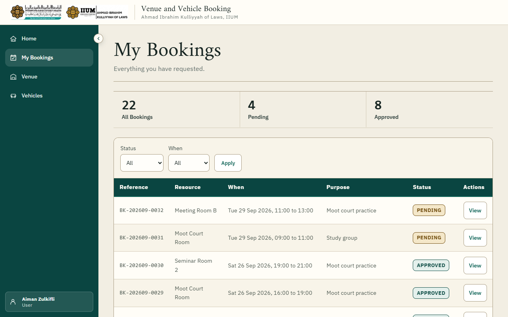

*My Bookings. Choose a reference to open that booking.*

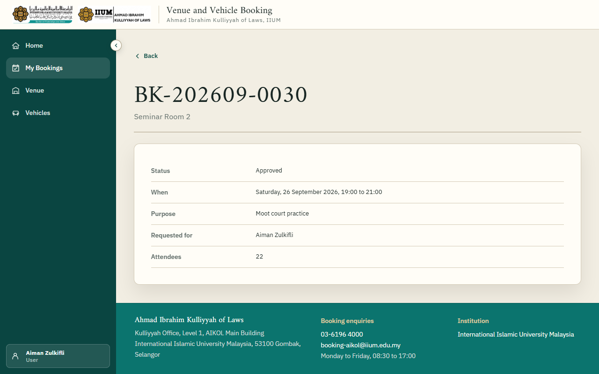

*One booking. Cancel booking is at the top while cancelling is still allowed.*

## 8. Cancel a booking

Open the booking under My Bookings and choose **Cancel booking**. Give a short reason.

You can cancel yourself up to **three days** before the booking starts. Closer than that, contact
the office; they can cancel it for you. Cancelled bookings stay in your history marked Cancelled;
the time is released for others straight away.

For a weekly series, cancelling from any one of its bookings offers to cancel all the future
dates together.

## 9. Keys

For an approved room booking, collect the key from the Kulliyyah office at the start of your
time and return it when you finish. The office records who collected it: if somebody else is
fetching the key for you, tell the office their name. A key that is not back after the booking
ends is followed up.

## 10. Your details

Under your name at the top, **Edit Profile** lets you change your name, email address and phone
number. If you change the email address you will be asked to confirm the new one before you can
book again. Your matriculation or staff number is set by the office; if it is wrong, tell them.

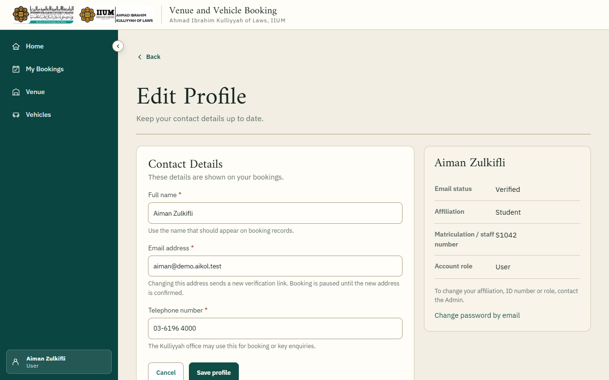

*Edit Profile.*

## If something goes wrong

| What you see | What it means |
| --- | --- |
| "Already reserved" when booking | Somebody has that time, approved or pending. Check the availability chart for a free slot. |
| "Not yet verified" after signing in | Click the link in the confirmation email. Ask the office if it never arrived. |
| Asked to wait after several sign-in attempts | Too many wrong passwords in a short time. Wait a quarter of an hour, or reset the password. |
| "Inside the three-day notice" when cancelling | Too close to the booking to cancel yourself. Contact the office. |
| A room or car is missing from the list | It is under maintenance or has been retired. Existing bookings on it are unaffected. |
| "Set the time on the quarter hour" | Times run in quarter hours. Choose :00, :15, :30 or :45 from the list. |
| A message that something did not reach the server | The reply was lost and the change may still have been saved. Reload the page and look before trying again. |

Kulliyyah office contact details are at the foot of every page.

*The screenshots show fictional demonstration data.*
